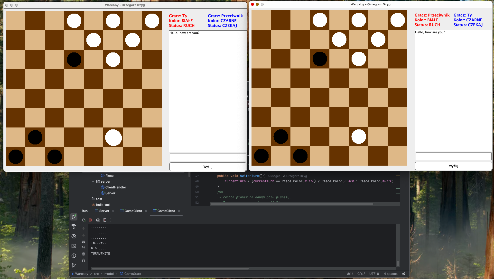
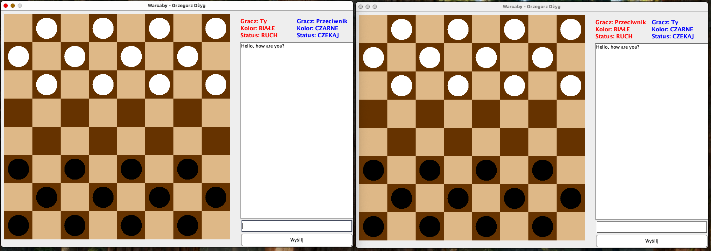
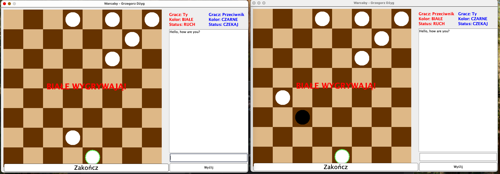

# Online Checkers — Java Swing

A two-player checkers game built in Java as a university programming project. Two desktop clients connect to a shared TCP server, exchange game state in real time and can communicate through an in-game chat.

The project demonstrates object-oriented programming, desktop UI development, socket communication, multithreading and implementation of game rules without an external game engine.

## Features

- two-player gameplay over TCP sockets,
- Java Swing desktop interface,
- central message relay between clients,
- move validation and mandatory captures,
- multiple captures in one turn,
- king promotion and movement,
- win detection,
- in-game chat saved locally to `chat_history.txt`.

## Tech stack

- Java 17
- Java Swing and AWT
- TCP sockets
- Java threads
- Ant / NetBeans project

## Project structure

```text
src/
├── client/   Swing UI and client-server communication
├── model/    board state, pieces and game rules
└── server/   socket server and connected-client handling
```

The server relays state and chat messages between two connected clients. Each client renders its own Swing interface and uses the shared text protocol to update the local game state.

## Running the game

The easiest option is to open the project in NetBeans with JDK 17.

1. Run `server.Server`.
2. Run `client.GameClient` twice.
3. The first client receives white pieces and starts the game.

The server listens on `localhost:8888`, so both clients run on the same machine by default.

You can also compile it from a terminal:

```bash
mkdir -p build/classes
javac --release 17 -encoding UTF-8 -d build/classes $(find src -name "*.java")
```

Then start the server and two clients in separate terminals:

```bash
java -cp build/classes server.Server
java -cp build/classes client.GameClient
java -cp build/classes client.GameClient
```

## Screenshots

| Game board | Multiplayer chat |
| --- | --- |
|  |  |



## Project status

This is an earlier learning project and intentionally remains a compact Swing application rather than being rewritten with a newer UI or networking framework. Current limitations include local-host configuration, support for exactly two players and no automated test suite. These are natural next steps rather than hidden production features.

## License

This project is available under the [MIT License](LICENSE).

## Author

Grzegorz Dżyg
